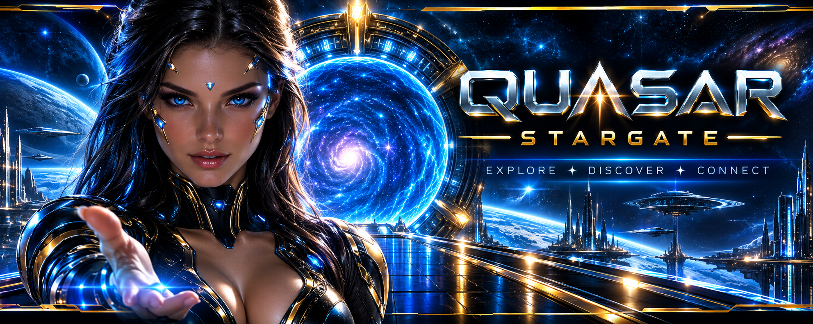
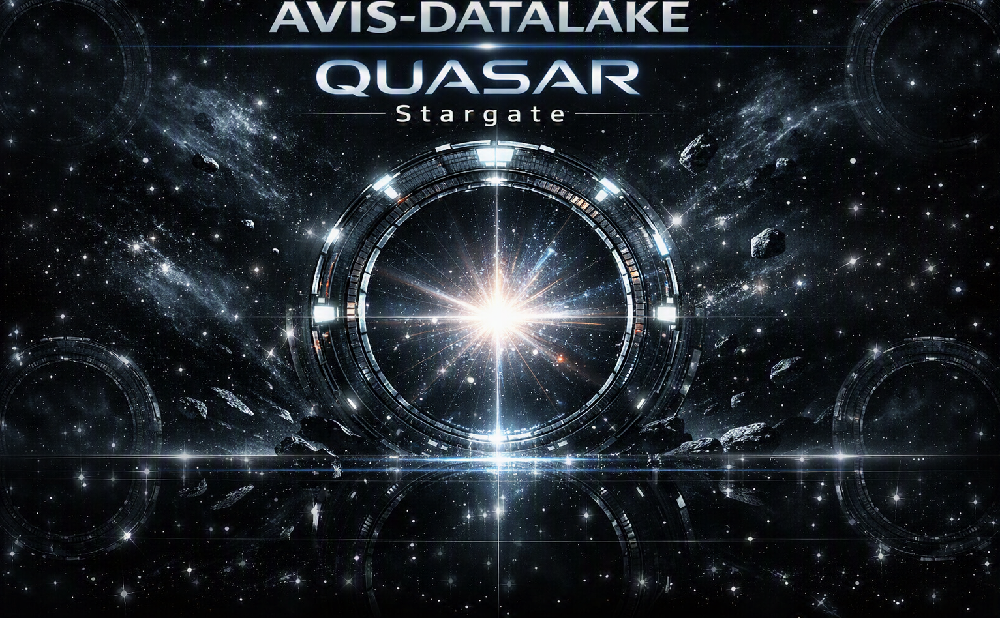
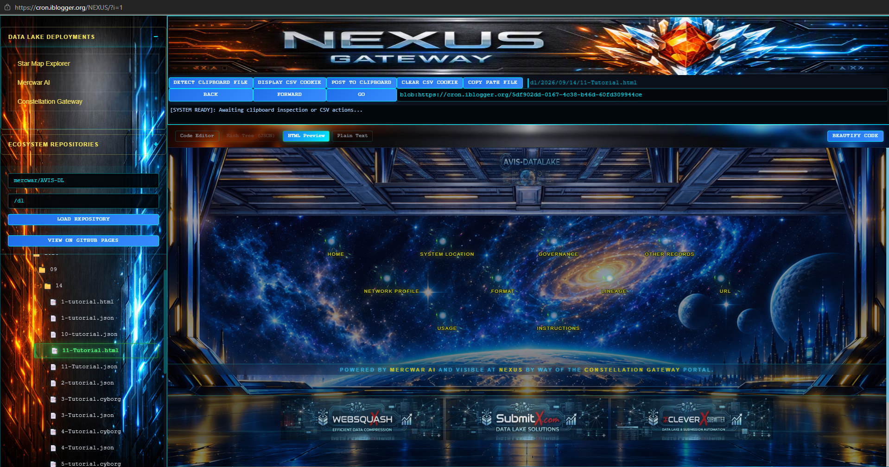
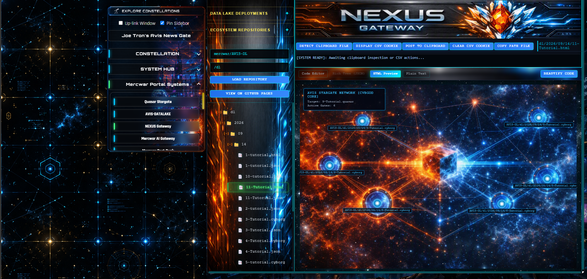

<a target="_self" title="CLICK HERE to ENTER the GATEWAY FREE!" href="https://mercwar.github.io/Constellation/index.html">

</a>

# 🌌 Quasar Stargate & Core Guide

## Overview
<a target="_self" title="CLICK HERE to ENTER the GATEWAY FREE!" href="https://mercwar.github.io/Quasar/index.html?quasar=AVIS-DL%2Fdl%2F2026%2F09%2F14%2F9-Tutorial.quasar">

</a>

The Quasar Stargate is the visual navigation console for AVIS‑DATALAKE (AVIS‑DL). Each active gate represents a dynamic target payload node. Engaging a gate decodes its .cyborg manifest or .quasar star-map stream, opening an interactive modal to route payload records directly through GitHub.
Mathematically validated for recursive potential, Quasar has the proven capability to operate as a fully staged, multiplayer interactive environment. By linking to functional Artifact files from other players, you can build a JavaScript web application hosted entirely via GitHub Pages.

## Deploying Your Own Stargate
<a target="_self" title="CLICK HERE to ENTER the GATEWAY FREE!" href="https://mercwar.github.io/Quasar/index.html?quasar=AVIS-DL%2Fdl%2F2026%2F09%2F14%2F9-Tutorial.quasar">

</a>

#

While you can continue using the default AVIS-DL ecosystem, you can also clone the repository to host Quasar on your own PHP/CGI server or GitHub Pages. The repository contains a fully functional index.html and JavaScript file ready for deployment.
To set up your personal NEXUS Gateway:

   1. Clone the repository to your own GitHub account.
   2. Update the Nexus configurations by replacing the default 'mercwar/AVIS-DL' repository path with your own DataLake details.
   3. Uplink your JSON application to AVIS-DATALAKE to point end-users toward your cloned repository using the following URL structure:
   https://<your_github_username>.github.io/Quasar/index.html?quasar=<your_dl>/dl/year/month/day/1-Tutorial.quasar

Once configured, you can use the NEXUS Gateway to navigate. Note that to manage your own standalone DataLake records, you will need to save them to your own private host or server-side application.
To create your own Stargate, it is only necessary to clone Quasar and connect to NEXUS from AVIS-DL 


The stargate is avaiblable at the  [Quasar](https://mercwar.github.io/Quasar/index.html?quasar=AVIS-DL%2Fdl%2F2026%2F09%2F14%2F9-Tutorial.quasar) Tutorial

#


<a href="https://cron.iblogger.org/AVIS-DATALAKE">
  
</a>

👉 *Uplink:* [AVIS-DATALAKE - Stargate interface](https://cron.iblogger.org/AVIS-DATALAKE)  
👉 *Uplink:* [NEXUS - Stargate interface](https://cron.iblogger.org/NEXUS)

👉 **This Uplink: [Stargate](https://mercwar.github.io/Quasar/index.html?quasar=AVIS-DL%2Fdl%2F2026%2F09%2F14%2F9-Tutorial.quasar) Quasar**


## AVIS Starmap Project
An advanced, decentralized DHTML star system visualization engine and data indexing ecosystem running natively on GitHub Pages. The project maps structural data files onto an interactive stellar node network.
## Core System Architecture
The ecosystem relies on two specialized, plain-text plain-text data registry layouts designed to link distributed nodes chronologically across the AVIS-DL datalake pipeline:

<a target="_self" title="CLICK HERE to ENTER the GATEWAY FREE!" href="https://mercwar.github.io/Quasar/index.html?quasar=AVIS-DL%2Fdl%2F2026%2F09%2F14%2F9-Tutorial.quasar">

</a>

#

* .cyborg: Node Coordinate Matrix
Plain-text comma-separated CSV paths. Every path represents a unique data coordinate node within the network infrastructure. Valid entries are restricted to ecosystem extensions (.json, .html, .md, .js, .css, .txt, .xml, .cyborg, .quasar).
* .quasar: Stargate Manifest Indexer
Master stargate catalog manifest files. A .quasar file holds a raw comma-separated list pointing exclusively to .txt target data records containing nested .cyborg paths, anchoring terminal routing layouts dynamically.

## DHTML Visualization Engine
The front-end map terminal dynamically translates backend stargate registries into an atmospheric space canvas using HTML5, CSS3, and JavaScript.

* Deterministic Matrix Generation: Node coordinates are generated procedurally from file text strings via character-based checksum metrics. Every unique data point maps permanently to its own cosmic signature location.
* Ambient Interface Rendering: The map utilizes explicit structural layouts, an alpha-transparency vector blend mask, and glow filters to overlay HUD system statistics, data list models, and interactive terminals flawlessly.

## Gateway Ingress URL Protocol
Launch localized system maps directly by supplying a target manifest coordinate route via the quasar global GET query parameter layer:

*Quasar protocol:*
```
https://mercwar.github.io/Quasar/index.html?quasar=<repo/dir/year/month/day/filenum-title.*avis-datalake home extenstions*>
```
*Instrucitons:*

- Click the image below and goto [NEXUS](https://cron.iblogger.org/NEXUS)
- Click 'Load Repository for  'mercwar/AVIS-DL' and '/dl' loaded into the boxes
- Navigate to dl/2026/09/14/11-Tutorial.html
- Select view with 'HTML Preview'
- Scroll to the bottom of the JSON after the page loads, in the window you will see a scroll bar on a small screen
- Look for a blue button  'ENGAGE STARGATE GATEWAY →' click it!
- You will see the tutorial Quasar load
- GOOD LUCK!
- ###### "<i>I am CVBGOD, and I have given it to you</i>!"

<a href="https://cron.iblogger.org/NEXUS">
  
</a>


------------------------------
## GitHub Search Context Metadata

* Project Name: AVIS starmap project
* Architecture: PHP 8.5+ Server Backend / GitHub Pages Front-End
* Primary Engines: DHTML Star System Visualization Engine, cURL Sequence Ingress Gateway
* Extension Layers: .quasar (Stargate Manifest Registry), .cyborg (Data Node Coordinate File)
* Repository Path Layout: github addresses for github pages do follow syntax '../'
* Linking to '../' from thw AVIS-DL folder would be the same thing as 'CD github.com/mercwar' from outside of the internet 

# ⚖️ MERCWAR LEGAL SECTION

All systems, interfaces, assets, and data‑handling mechanisms within the Mercwar Network—including AVIS‑DATALAKE, the Star Map Commander, and all affiliated gateways—operate under a permanent‑record public storage model. By using any Mercwar submission interface, you agree to the following binding conditions.

### DATA SUBMISSION & STORAGE
All submitted content is written directly into the AVIS‑DL public repository.  
Every file becomes a permanent, immutable entry in the public ledger.  
Files cannot be edited, renamed, removed, or obscured once written.

Submitting content through any Mercwar gateway constitutes full consent to:
- permanent public storage,
- unrestricted public visibility,
- and irreversible archival under the AVIS‑DL system.

### USER RESPONSIBILITY
You are solely responsible for the material you submit.  
You must ensure that your content:
- contains no sensitive personal information,
- contains no confidential or proprietary data,
- and complies with all applicable laws and regulations.

Mercwar assumes no liability for user‑submitted content or any consequences arising from its public availability.

### SECURITY & PROHIBITED USE
Mercwar systems automatically sanitize and validate incoming payloads.  
You may not upload:
- malicious code,
- harmful payloads,
- illegal content,
- or any material intended to disrupt or compromise system integrity.

Violations may result in permanent termination of submission access.

### COPYRIGHT & OWNERSHIP
All original Mercwar assets—including logos, UI systems, Star Map designs, AVIS‑DL architecture, and documentation—are protected under applicable copyright law.

User‑submitted content remains the intellectual property of the submitting party.  
However, by submitting content, you grant Mercwar a **perpetual, irrevocable, worldwide license** to store, display, and distribute the material as part of the AVIS‑DL public archive.

### PLATFORM SCOPE
Mercwar systems function as experimental, public‑facing technology demonstrations.  
By using these systems, you acknowledge:
- their experimental nature,
- the absence of warranties,
- and the permanent, public nature of all submissions.

Continued use of the Mercwar Network signifies acceptance of all terms in this Legal Section.

Copyright © 2026 MercWar AI — All Rights Reserved.


